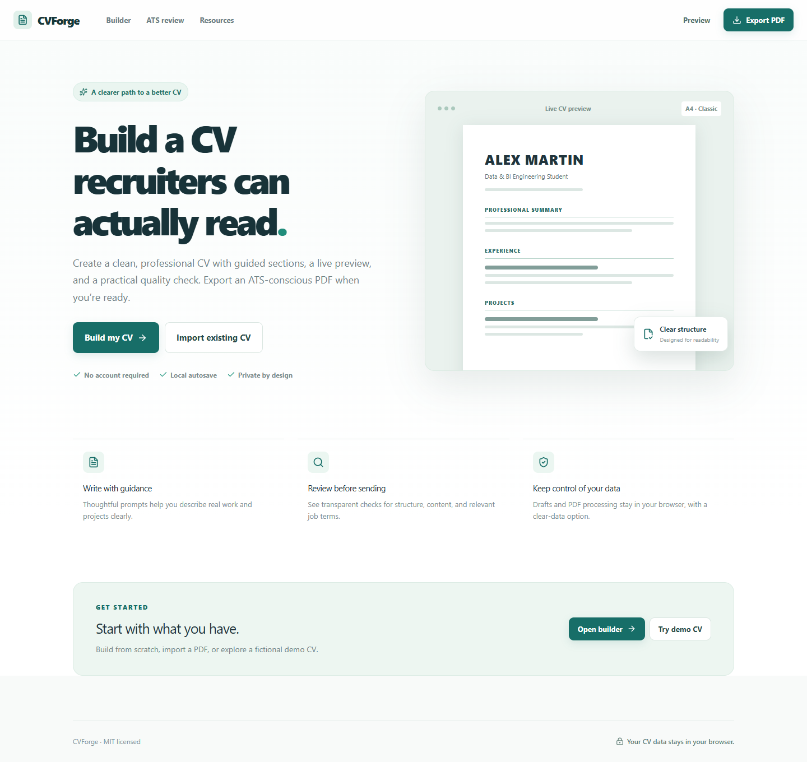
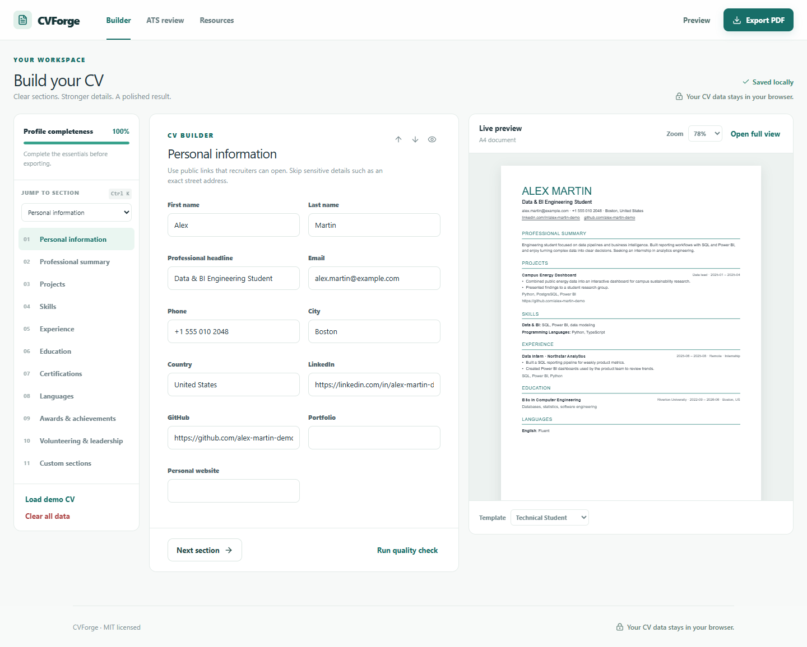
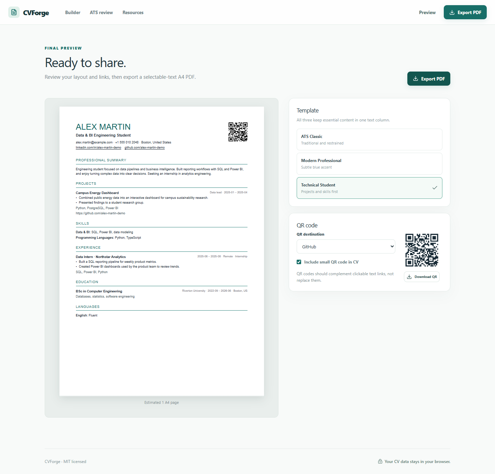
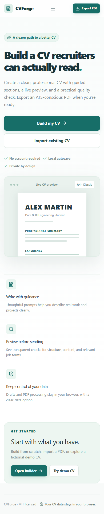

# CVForge

**Build a CV recruiters can actually read.** CVForge is a private, browser-based builder for clear, professional, ATS-conscious CVs. This repository contains Step 1: the CV Builder. A portfolio builder can later consume the same candidate profile.

## Features

- Guided editor for contact details, summary, education, experience, projects, skills, certifications, languages, awards, volunteering, and custom sections
- Section visibility and ordering; entry ordering, duplication, and deletion
- Live A4 preview with three one-column templates: ATS Classic, Modern Professional, and Technical Student
- Local PDF CV and LinkedIn profile PDF import with an explicit review step
- Transparent 100-point CV quality check and local job-description term comparison
- QR code preview, separate download, and optional inclusion in the CV
- Selectable-text A4 PDF export with hyperlinks, margins, and page handling
- Browser-local autosave, draft restoration, and clear-data confirmation
- Responsive interface, keyboard access, and a fictional demo profile

## Screenshots



| Builder | Final preview | Mobile |
| --- | --- | --- |
|  |  |  |

All screenshots use fictional demo data.

## Why CVForge?

Students and early-career applicants often have real work to show but need help presenting it clearly. CVForge provides structure and specific guidance without inventing achievements or promising a screening result.

## Tech stack

React 19, TypeScript in strict mode, Vite, Tailwind CSS 4 with a small custom design system, React Router, Zod, Lucide, PDF.js, pdf-lib with Noto Sans, QRCode, Vitest, and Playwright for browser smoke checks. Import and export libraries load only when needed.

## Privacy

CV and LinkedIn PDF text is processed in the browser. Drafts are stored in this browser's `localStorage` under `cvforge.profile.v1`. No account, server, analytics, or remote CV storage is used in Step 1. The interface has a **Clear all data** action. Hosting the static site still requires the normal network request to load its files; external links open only when the user chooses them.

## Local development

Requires Node.js 22 or newer.

```bash
npm install
npm run dev
npm run lint
npm test
npm run build
npm run preview
```

The Vite base path is `/cvforge/`. Open the URL printed by Vite. Routes use URL hashes so direct navigation and refresh work on GitHub Pages without server rewrites.

For a browser smoke check, run the development server and then:

```bash
node tests/smoke.mjs
```

The smoke script uses an installed Chrome by default on Windows. Set `CHROME_PATH` for another installation. Pass a PDF path as the optional first argument to check import locally. The script saves temporary screenshots and an exported test PDF in the system temp folder, outside the repository.

## Deployment

`.github/workflows/pages.yml` runs lint, tests, and a production build, then deploys `dist` from `main` with GitHub Pages. After creating the repository, select **GitHub Actions** as the Pages source in repository settings. The expected URL is `https://<username>.github.io/cvforge/`.

The repository has no remote until publication. With GitHub CLI installed and authenticated:

```bash
gh repo create cvforge --public --source . --remote origin --push
```

Or create an empty `cvforge` repository on GitHub and then run:

```bash
git remote add origin https://github.com/<username>/cvforge.git
git push -u origin main
```

## Architecture

- `src/models/profile.ts` defines the versioned `CandidateProfile` used across features.
- `src/context/ProfileContext.tsx` owns local editing and persistence state.
- `src/services/validation.ts` validates restored drafts and URLs, and calculates completion.
- `src/services/import.ts` maps extracted text into a reviewable profile; `pdfExtract.ts` reads PDF text locally.
- `src/services/review.ts` and `match.ts` implement deterministic, explainable guidance.
- `src/services/pdf.ts` creates selectable-text PDFs, including links and optional QR.
- `src/components/` contains the section editor and document preview.
- `src/pages/` contains the landing, builder, import, review, preview, and resources flows.
- `src/App.tsx` defines shared navigation and routes.

The profile model does not depend on the CV UI or PDF layout. Future modules can read the same `CandidateProfile` and add persistence adapters without changing its meaning. See [architecture notes](docs/architecture.md).

## Limitations

- PDF imports are heuristic. Scanned or image-only PDFs need manual entry, and all imported details require review.
- The browser preview estimates page count; the exported PDF uses its own pagination. Review the downloaded PDF before submitting it.
- PDF export currently supports Latin text well. Other writing systems may be replaced with placeholder characters until more fonts are added.
- Job comparison measures term overlap, not semantic fit. The ATS readiness score is guidance, not a guarantee.
- Drafts remain on one browser/device and can be removed by browser storage clearing.

## Roadmap

1. **Phase 1 — ATS CV Builder:** current version.
2. **Phase 2 — Portfolio Website Builder:** reuse `CandidateProfile` for a portfolio and GitHub Pages site.
3. **Phase 3 — Optional cloud profiles:** accounts and sync only if users explicitly opt in.

## Contributing

Open an issue with a reproducible example. For code changes, run `npm run lint`, `npm test`, and `npm run build` before opening a pull request. Never add real CV data to fixtures or screenshots.

## License

MIT. See [LICENSE](LICENSE).
